This repository contains code and or supplementary materials related to [**Mocarabe: High-Performance Time-Multiplexed Overlays for FPGAs**](https://ieeexplore.ieee.org/document/9444076)

# Mocarabe

[](https://github.com/gigeresk/mocarabe/actions/workflows/ci.yml)
Mocarabe is a CGRA (Coarse-Grained Reconfigurable Array) architecture generator and a fully-custom EDA (electronic design automation) toolchain. It takes a dataflow graph (DFG) compiled from a C kernel, packs and places nodes on processing elements, schedules computation onto a 2-D torus network-on-chip using integer linear programming (ILP) or a  temporal-spatial PathFinder router, and generates synthesizable SystemVerilog RTL with a accompanying simulation artifacts. The Python toolchain handles scheduling, placement, and RTL generation. The hardware consists of pipelined PEs (supporting add, multiply, and IO operations) connected via a torus NoC with configurable channel widths.

The export targets are simulation with Icarus Verilog and implementation with Xilinx FPGAs.

## Flow



--- 
## Setup
```
python3 -m venv .venv
source .venv/bin/activate
pip install -e .[dev]
sudo apt install iverilog  # for simulation
```
Some optional scripts use vivado. The use of Gurobi has been replaced by SCIP.

## Synthesizing Benchmarks
Mocarabe can map arbitrary dataflow C kernels onto a coarse-grained compute architecture.
This is done with a custom LLVM pass which extracts the dataflow graph (DFG) from the C kernel.
The DFG is extracted in a hypergraph format (one edge can fan out to multiple nodes)
### Building and Running the LLVM pass
1. Build the plugin (once):
```
make -C llvm_pass
```

2. Extract a DFG from a C file:
```
./llvm-with-clang.sh <benchmark_file.c> hgr/
```
For example,
```
# int_adder_chain.c

int int_adder_chain(int x, int y, int z, int a, int* ret) {
	*ret = x+y+z+a;
}
```
Can be synthesized with
```
./llvm-with-clang.sh int_adder_chain.c hgr/
```

## Running Designs through Mocarabe
Example usage: 
```
mocarabe -dfg hgr/int_adder_chain -iod 1 -ard 1 -II 1 -C 20 --place_time 0.1 --sched_method ILP
```
This will generate an architecture of appropriate size and map the given design (in this case, int_adder_chain) to it.

### Command line arguments
```
-dfg: path to the dataflow graph directory
-II: initiation interval: also the schedule length and the desired level of resource sharing.
--log: Log output is written to this `csv` around schedule time (lines commented ('#') when scheduling starts and when C has to be incremented, but full line taken up on final success/failure).  Look at `mocarabe/scheduler/__init__.py` for details.
--place_time: Annealing placement needs a time (it's not accurate, it somehow finds an iteration count based on this number and some other factor- could change this with experimentation).  For something in the order of 4x4, 0.1-0.2 is sufficient.  For the largest benchmarks, and for experiments, 1 is my go-to.
--sched_method: 'ILP' (integer linear programming) or 'PF' (pathfinder).  Default is 'ILP'.
-iod: Packing diffusion for IO PEs (controls how densely IO nodes are packed)
-ard: Packing diffusion for +/* PEs (controls how densely compute nodes are packed)
```
## Using the GUI
Running the command above will emit a project directory path. The visualization GUI can be used to visualize the generated architecture and how the benchmark was mapped.

```bash
mocarabe-viz --proj <benchmark-run-dir>/
```

## RTL Architecture
The architecture consists of a 2D array of building blocks connected by a directional torus network-on-chip (NoC) as shown in figure below. Each block contains both a PE to execute operations on incoming data and a set of NoC routers to control data movement.  
A PE can be configured as either an operator (multiply or add) or a data input/output. Multipliers and adders are the currently supported operator types. PEs store incoming operands in shift registers and select the relevant stored operands as inputs to their ALU at each cycle, as shown in figure below. Operand selection at each cycle is extracted from the compiler output.


A key feature of the architecture is the variable number of parallel physical communication channels. Every router point accepts inputs from the local PE, the south, and the west neighbors on the same channel and sends outputs north, east, and to the local PE (with wrap-around links completing the toroidal topology). A single-channel router point is shown in figure below.


The entire architecture is designed for statically-scheduled, time-multiplexed operation. With an initiation interval II (which can also be though of as context count), every routing and functional resource will repeat the same task, accept inputs, and drive outputs in a repeating phase of II cycles. II is thus also the number of operations mapped to a resource which can enable larger applications to be mapped to fewer blocks at the cost of more LUTs to drive multiplexer select lines (context memories labeled "CTX" in figures above). II is the number of cycles in the modulo schedule found by the compiler. Operation execution and data movement are statically scheduled and encoded as multiplexer select line memories. An application can be mapped over a subset of all available PEs and unrolled (repeated) by tiling over the full array. If the number of communication channels is greater than one, PE inputs are fanned in from each channel to both shift registers. The figure below shows an M x N array with 3 communication channels and two input PEs.


For details about the (archived) Vivado implementation on Alveo U280, see [vivado.md](export/vivado.md).

### How to Cite

If you use any part of the code or data from this repository for academic work, please cite the associated paper as follows:

```bibtex
@INPROCEEDINGS{9444076,
  author={Tombs, Frederick and Mellat, Alireza and Kapre, Nachiket},
  booktitle={2021 IEEE 29th Annual International Symposium on Field-Programmable Custom Computing Machines (FCCM)},
  title={Mocarabe: High-Performance Time-Multiplexed Overlays for FPGAs},
  year={2021},
  doi={10.1109/FCCM51124.2021.00021}
}
```
