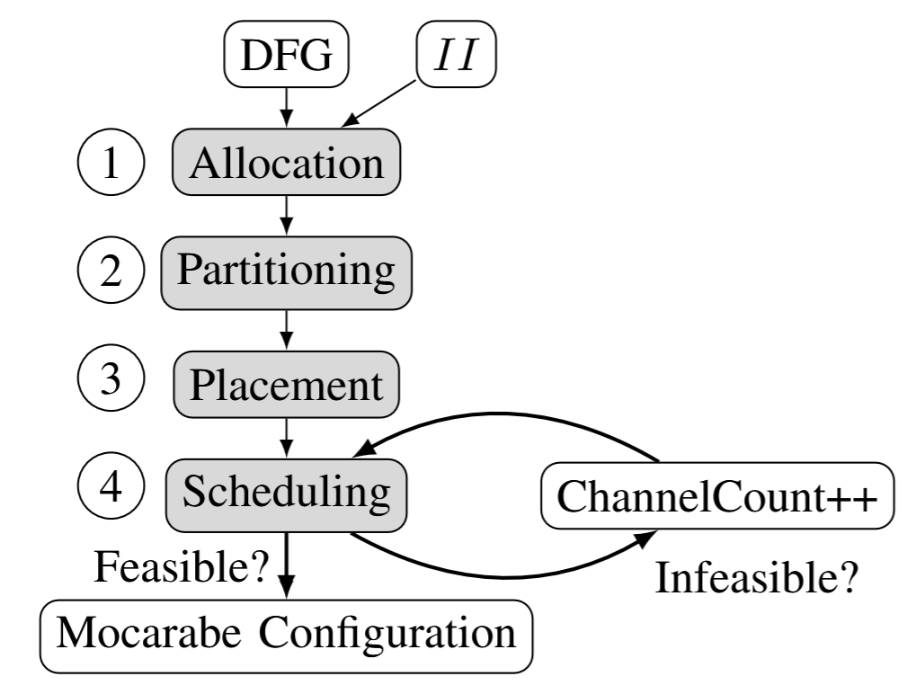

# Mocarabe

[](https://github.com/gigeresk/mocarabe/actions/workflows/ci.yml)  

Mocarabe is a CGRA (Coarse-Grained Reconfigurable Array) architecture generator and a fully-custom toolchain. The implementation and results are discussed in [Mocarabe: High-Performance Time-Multiplexed Overlays for FPGAs](https://ieeexplore.ieee.org/document/9444076), published at FCCM 2021. This work was done by Frederick Tombs, Alireza Mellat, and Prof. Nachiket Kapre.

To get started, jump to [Toolchain setup](#toolchain-setup).

## Architecture 
The architecture consists of a grid of building blocks connected by a unidirectional torus network, as shown in the figure below. Each block contains a processing element (PE) to execute operations on incoming data and a set of NoC routers to control data movement.

PEs store incoming operands in shift registers and select the relevant stored operands as inputs to their ALU at each cycle, as seen below.


The architecture is designed for statically-scheduled, time-multiplexed sharing of both routing and compute resources, with a repeating context window of length *II* (for *initiation interval*). *II* is the number of cycles in the modulo schedule found by the compiler. Operation execution and data movement are statically scheduled and encoded as multiplexer select line memories. An application can be mapped over a subset of all available PEs and unrolled (repeated) by tiling over the full array. If the number of communication channels is greater than one, PE inputs are fanned in from each channel to both shift registers.

## Toolchain
The toolchain:
- Compiles a C kernel into a DFG
- Generates a right-sized architecture by allocating PEs
- Partitions nodes into processing elements
- Places these PEs in the grid to minimize communication cost (wirelength)
- Schedules routing and computation
- Generates both synthesizable RTL and simulation artifacts.  

Placement is done with simulated annealing and scheduling has dual strategies: an integer linear programming (ILP) formulation and a temporal-spatial PathFinder implementation.



### Toolchain setup
```
python3 -m venv .venv
source .venv/bin/activate
pip install -e .[dev]
# install icarus verilog. e.g. on Ubuntu:
sudo apt install iverilog
make -C llvm_pass  # build the LLVM plugin to compile C->DFG
```
### Quick example
```
./llvm-with-clang.sh <benchmark_file.c> hgr/
```
For example,
```
# int_adder_chain.c

int int_adder_chain(int x, int y, int z, int a, int* ret) {
	*ret = x+y+z+a;
}
```

```
# C -> dfg
./llvm-with-clang.sh int_adder_chain.c hgr/

# Generate architecture and map int_adder_chain to said arch
# II = context width/schedule length, C = channel count, iod/ard: io/arithmetic packing density
mocarabe -dfg hgr/int_adder_chain -II 1 -C 20 -iod 1 -ard 1
# Visualization tool
mocarabe-viz --proj <benchmark-run-dir>/
```


## How to Cite

If you use any part of the code or data from this repository for academic work, please cite the associated paper as follows:

```bibtex
@INPROCEEDINGS{9444076,
  author={Tombs, Frederick and Mellat, Alireza and Kapre, Nachiket},
  booktitle={2021 IEEE 29th Annual International Symposium on Field-Programmable Custom Computing Machines (FCCM)},
  title={Mocarabe: High-Performance Time-Multiplexed Overlays for FPGAs},
  year={2021},
  doi={10.1109/FCCM51124.2021.00021}
}
```
