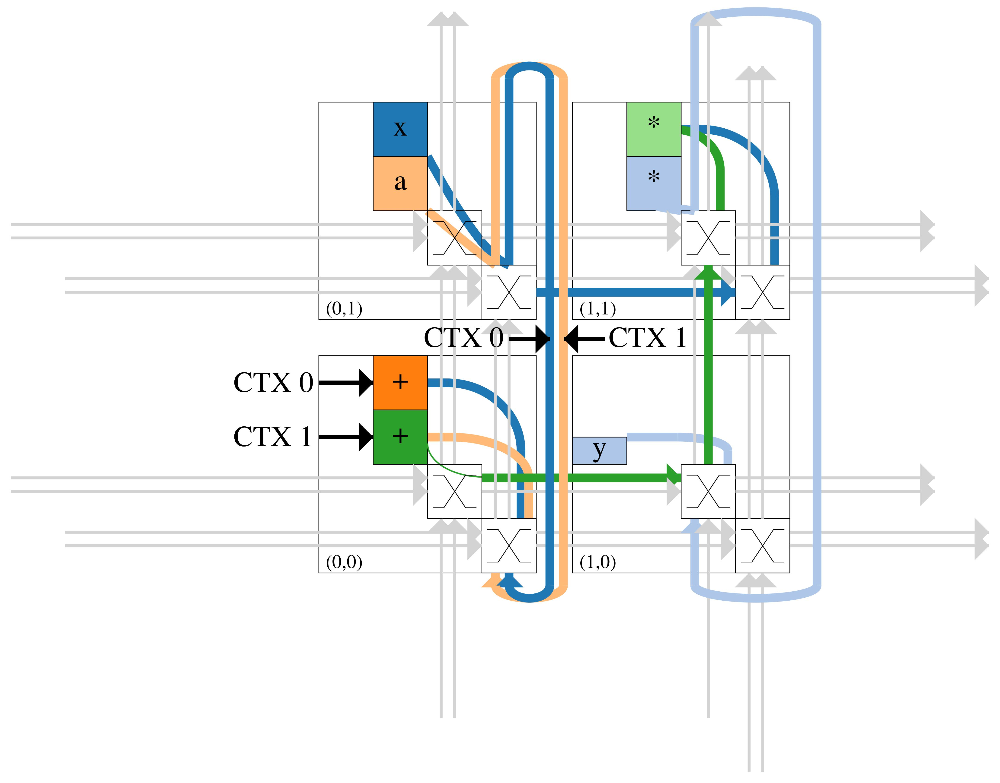
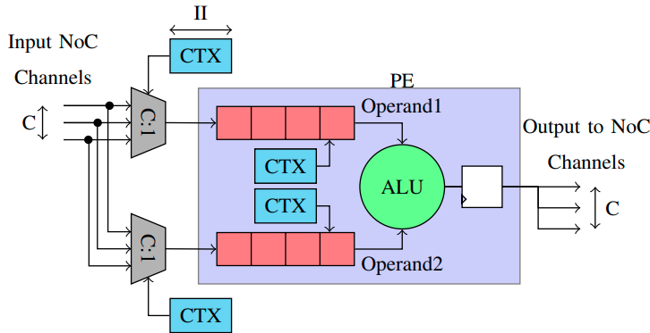
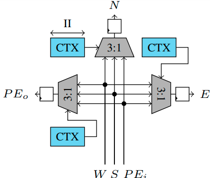
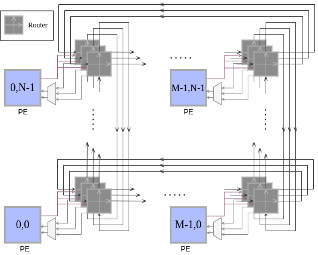
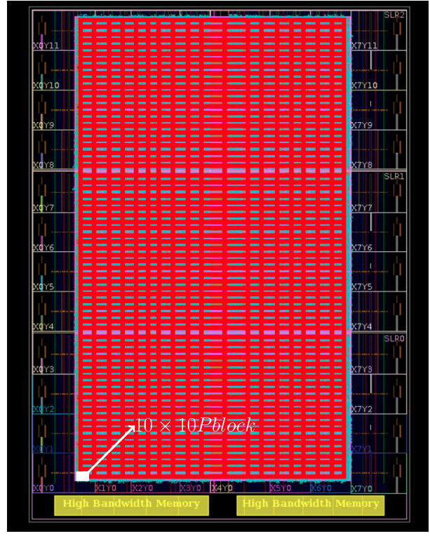

# README for cgra-ilp/Mocarabe

There are three major components for setup: Gurobi installation, cgra-ilp dependency installation, and gcc-python-plugin setup

<a name="installing_gurobi"></a>
## Installing Gurobi

You will need Gurobi (latest version available for academic use)-- please download it from gurobi.com, where you can also get an [academic license](https://www.gurobi.com/academia/academic-program-and-licenses/).  You must be connected to your institution's network (VPN or on-prem).

```
cd ~/Downloads
#replace x with gurobi version
tar -xzf gurobix_linux64.tar.gz
```

Managing your permissions carefully, copy the untarred folder to a folder like `/opt/`.
Follow the instruction on Gurobi's website (such as running grbgetkey to activate your license).

You can add the following to your ~/.bashrc (feel free to add
the equivalent for other shells)

```
# gurobi
#set appropriate gurobi folder name based on your gurobi version
export GUROBI_HOME="/opt/gurobi902/linux64"
export PATH="$PATH:/opt/gurobi902/linux64/bin/"
export LD_LIBRARY_PATH="${LD_LIBRARY_PATH}:${GUROBI_HOME}/lib"
```
In `/opt/gurobi902/linux64`, run

```
python3 setup.py install --user
```

If
```
python3 -c "import gurobipy"
```
 doesn't throw an error, you're good to go.


Now that Gurobi is installed, on to other dependencies!

## Other dependencies

### Ubuntu 18.04.1 LTS, valid as of Feb 11 2021

Run the following
```
sudo apt update
sudo apt install python3-pip python3-pil.imagetk dot2tex zsh gcc-9-plugin-dev jq

# Please use python3 (3.6 and above, we use fstrings)
pip3 install -r requirements.txt
```


## GCC Plugin Setup

Use the following command to add gcc python plugin:
```bash
git submodule add ist-git@git.uwaterloo.ca:watcag-public/gcc-python-plugin.git src/gcc-python-plugin
```
gcc-python-plugin must be built with python3.5

use the following commands to setup
```
#WORKDIR refers to your working folder, which includes this repository
export CGRA_ILP_PATH=~/WORKDIR/cgra-ilp
export GCC_PLUGIN_PATH=$CGRA_ILP_PATH/src/gcc-python-plugin
export LD_LIBRARY_PATH=$LD_LIBRARY_PATH:$GCC_PLUGIN_PATH:$GCC_PLUGIN_PATH/gcc-c-api
export PATH="$PATH:/usr/local/etc/cmake-3.15.5-Linux-x86_64/bin"
```

Must install `sudo apt install gcc-8-plugin-dev` (replace 9 with whatever version of gcc you're using).  If you don't, building the plugin will result in this error ( FileNotFoundError: [Errno 2] No such file or directory: '/usr/lib/gcc/x86_64-linux-gnu/7/plugin/include/auto-host.h'
)
do sudo apt-get install python3.5
`make PYTHON=python3.5 PYTHON_CONFIG=python3.5-config` in the gcc-python-plugin
**Running**
For executing the code, you have to setup the environment first.  Add the following to your shell .*rc file:

```
export LD_LIBRARY_PATH=../gcc-python-plugin/gcc-c-api:../gcc-python-plugin
export GCC_PLUGIN_PATH=../gcc-python-plugin
./gcc-with-python.sh hls.py <file.c>
```
If you get an error like "./gcc-with-python.sh:6: command not found: gcc-7", feel free
to change the gcc version or install a different version with e.g.`sudo apt -y install gcc-7 g++-7` `sudo update-alternatives --install /usr/bin/gcc gcc /usr/bin/gcc-7 7`.  These won't change your default gcc version ( you can do that with `sudo update-alternatives --config gcc`
)
Each C file is currently taken from the `bitgpu/bench` repository as it is nicely packaged up into simple dataflow functions.


# Workflow
If you can run this next line without hitting an error, congratulations!  Your're all set up.
```
python3 mocarabe.py -dfg hgr/int_poly3 -iod 1 -ard 1 -II 1 -C 2 --place_time 0.1 --sched_method ILP
```
## Compiling Benchmarks
Our precompiled benchmarks are located in in `hgr/`. Do the following if you wish to compile your own:

1. `git checkout cgra-ilp` in the watcag/gcc-python-plugin repository.
2. Env vars for the gcc python plugin: `export LD_LIBRARY_PATH=$LD_LIBRARY_PATH:<path/to/..>/gcc-python-plugin/gcc-c-api/:<path/to/..>/gcc-python-plugin/`
3. From this repository, to create the DFG using gcc (example: int_gaussian.graph): `./gcc-with-python.sh hls.py "bench/bitgpu/int_gaussian.c"`

For the `int_gaussian` benchmark, ouput would be in `hgr/int_gaussian/int_gaussian.hgr`.  Details on this format can be found in src/SRC_README.md under the dataflow_hypergraph heading.

## Running Benchmarks through Mocarabe
Example usage: `python3 mocarabe.py -dfg hgr/int_poly3 -iod 1 -ard 1 -II 1 -C 2 --place_time 0.1 --sched_method ILP`

### Command line arguments

- `-dfg`: path to the dataflow graph directory
- `-II`: initiation interval: also the schedule length and the desired level of resource sharing.
- `--log`: Log output is written to this `csv` around schedule time (lines commented ('#') when scheduling starts and when C has to be incremented, but full line taken up on final success/failure).  Look at `src/scheduler/__init__.py` for details.
- `--tag`: A log feature: a column is taken up by this string. Useful in scripts when comparing two approaches (e.g. "PF" or "ILP", as those aren't logged (though maybe they should be))
- `--place_time`: Annealing placement needs a time (it's not accurate, it somehow finds an iteration count based on this number and some other factor- could change this with experimentation).  For something in the order of 4x4, 0.1-0.2 is sufficient.  For the largest benchmarks, and for experiments, 1 is my go-to.
- `--sched_method`: ILP or PF.  Default is ILP.
- `-iod`: Diffusion factor for IO PEs
- `-ard`: Diffusion factor for +/* PEs

## Using GUI
Running the command above generates a command in the end which you can use to visualize the system and use the GUI. A sample command would look like this:

```bash
python3 src/torus_gui_freeze.py --proj proj/benchmark_name--time_when_benchmark_was_ran/ --zoom 5
```

You can paste the command in your terminal to open GUI. The image below shows a sample GUI:



## RTL Architecture
The Mocarabe architecture consists of a 2D array of building blocks connected by a directional torus network-on-chip (NoC) as shown in figure below. Each block contains both a PE to execute operations on incoming data and a set of NoC routers to control data movement.
 - A PE can be configured as either an operator (multiply or add) or a data input/output.MULTIPLIERS and adders are the currently supported operator types.PEs store incoming operands in shift registers and select the relevant stored operands as inputs to their ALU at each cycle, as shown in figfure below. Operand selection at each cycle is extracted from the compiler output.

 

 - A key feature of our architecture is the variable number of parallel physical communication channels Every router accepts inputs from the local PE and the south and west neighbors on the same channel and sends outputs north, east, and to the local PE. A single-channel router is shown in figure below.

  

The entire architecture is designed for statically-scheduled,time-multiplexed operation. With an initiation interval or (con-text count)II, every routing and functional resource will repeat  the  same  task, accept inputs, and drive outputs in a repeating  phase  of II cycles. II is thus also  the  number ofoperations mapped to a resource which can enable larger appli-cations to be mapped to fewer blocks at the cost of more LUTsto drive multiplexer select lines (context memories labeled“CTX” in figures above).II is the number of cycles in the modulo schedule found by the compiler. Operation execution and data movement are statically scheduled and encoded  as multiplexer select line memories. An application can be  mapped over a subset of all available PEs and unrolled (repeated) by tiling over the full array. If the number of communication channels is greater than one, PE inputs are fanned in from each channel to both shift registers. The figure below shows an M x N array with 3 communication channels and two input PEs.




**CGRA implementation and floorplanning**

We implement the Mocarabe overlay using parametric Verilog for PEs and  switches. We  use  Xilinx Vivado 2020.1 tosynthesize, place, and route the design on a Xilinx Alveo U280 card for analysis. We design hand-crafted placement scripts to effectively map the design and make use of FPGA resources while keeping the operation frequency high. Each logical block containing PE and switches is assigned to a physical block(Pblock) on the chip. We define an arbitrary estimate for eachPblock’s size as the number of logic slices  it contains, with each slice containing Look-Up Tables (LUTs) and flip flops.For instance, a 10×10 Pblock  can span the chip from slice X0Y0 to slice X9Y9, creating a rectangular area over the device that contains 100 slices.

The current implementation supports up to three communication channels and the array size of up to 19 x 69. The figure below shows a device oview of a 19 x 69 array with 2 communication channels in Vivado.



To run implementation, you would need a tcl script and a placement xdc file. There are tcl scripts and placement files provided in the rtl folder. To run Vivado using the tcl script (named cgra.tcl), go to the rtl folder and use the following command:
```bash
#this would open Vivado in command line mode
vivao -mode tcl -source cgra.tcl
```

Depending on the configuration, this could take several (>10) hours. The resulting frequency and resource usage can be found at the timing and utilization reports produced by the tcl file.

In short, a tcl script should look like this:

```tcl
#Create project
create_project cgra-ilp -f ./cgra-ilp -part xcu280-fsvh2892-2L-e
set_property board_part xilinx.com:au280:part0:1.1 [current_project]

#Add files
read_verilog rtl/mocarabe.v
read_verilog rtl/pe_srl.v
read_verilog -sv rtl/torus_switch.sv
read_verilog rtl/mocarabe.h
read_verilog rtl/benchmark.h
read_verilog -sv rtl/pe_2_input.sv
read_verilog -sv rtl/pe_1_input.sv
read_verilog -sv rtl/pe_mux_2_input.sv
read_verilog -sv rtl/pe_mux_3_input.sv
read_verilog rtl/SRL16E.v
read_verilog rtl/SRLC32E.v
read_verilog rtl/SRL64.v

#Read the xdc file
read_xdc mapping.xdc

#Synthesize design
#generics:
# PE_PIPE: Pe pipeline stages (dependant on number of channels)
# PIPENUM: Torous switch output pipeline stages
# PECONFIG: Array configuration. For each PE, 1 = multiplier and 0 = adder. The config bits are input from right to left, with the lsb being the pe at top left, and msb being the pe at bottom right. You can modify it to suit your configuration. Here, 9 is the array size.
synth_design -generic PE_PIPE=7 -generic PIPENUM=1 -generic PECONFIG=36'h101011001 -top mocarabe  -mode out_of_context -keep_equivalent_registers -retiming;
opt_design;
place_design;
phys_opt_design;
phys_opt_design -slr_crossing_opt -tns_cleanup;
route_design;
phys_opt_design;
report_utilization -file utilization_report.txt
report_timing -file timing_report.txt

```

A placement script should look like this:

```bash
create_clock -period 1.000 -name clk -waveform {0.000 0.500 } [get_ports clk]

#create a pblock for each logick block (PE + NoC routers)
#col number 0
create_pblock y0x0
add_cells_to_pblock [get_pblocks y0x0] [get_cells -quiet [list {ys[0].xs[0].cs[0].torus_switch_inst} {ys[0].xs[0].pe_inst}]]
add_cells_to_pblock [get_pblocks y0x0] [get_cells -quiet [list {ys[0].xs[0].mux_inst}]]
add_cells_to_pblock [get_pblocks y0x0] [get_cells -quiet [list {ys[0].xs[0].cs[1].torus_switch_inst}]]
add_cells_to_pblock [get_pblocks y0x0] [get_cells -quiet [list {ys[0].xs[0].cs[2].torus_switch_inst}]]
resize_pblock [get_pblocks y0x0] -add {SLICE_X16Y20:SLICE_X25Y29}
set_property gridtypes {DSP48E2 SLICE} [get_pblocks y0x0]
add_cells_to_pblock [get_pblocks y0x0] [get_cells ys[0].xs[0].pe_inst/* -filter {REF_NAME == DSP48E2}]
.
.
.
```

More information about the rtl code, tcl, and xdc file can be found in the rtl folder.

**Vivado HLS**

To run Vivado HLS for our benchmarks, you can go to the `hls` folder. There is a separate folder for each benchmark containing all the files and scripts needed to run the benchmark. To run each benchmark, you should run the `main.sh` script with the appropriate arguments. This is how you should run `main.sh`:

```bash
  ./main.sh benchmark_name unroll_factor json_file_containing_number_of_operators id target_frequency(700 MHz) target_ii

  #for instance, running for int_adder_chain with unroll factor of 170, operators located in ops.json, id of 700, and targetting ii=1 you should use the following command in the hls/int_adder_chain folder:
  # ./main.sh int_adder_chain 170 ops.json 510 700 1
```
‍‍We define `id` to be (unroll factor * number of operators). Unroll factor, number of operators, and id are unique for each benchmark and target ii. `iiunrolls.csv` located in hls folder contains information about parameters for each benchmark.

Once `main.sh` is finished, you can use `get_results.sh` to extract results and put them into `results.txt` in the same directory. This is what a results file would look like:

```bash
  adder_chain
  int_adder_chain_170_680_700
  results/int_adder_chain_170_680_700/solution1/syn/report/int_adder_chain_csynth.rpt
  BENCH, UNROLL_FACTOR, LUTs, FF, DSP, BRAM,FREQ, Latency, II,
  int_adder_chain, 170, 16349, 38132, 0, 0, 2.984,
  +  Latency:
    * Summary:
    +---------+---------+-----------+-----------+-----+-----+---------+
    |  Latency (cycles) |   Latency (absolute)  |  Interval | Pipeline|
    |   min   |   max   |    min    |    max    | min | max |   Type  |
    +---------+---------+-----------+-----------+-----+-----+---------+
    |       12|       12| 17.148 ns | 17.148 ns |   12|   12|   none  |
    +---------+---------+-----------+-----------+-----+-----+---------+

  --
        |          |  Latency (cycles) | Iteration|  Initiation Interval  | Trip |          |
        | Loop Name|   min   |   max   |  Latency |  achieved |   target  | Count| Pipelined|
        +----------+---------+---------+----------+-----------+-----------+------+----------+
        |- loop1   |       10|       10|         5|          1|          1|     6|    yes   |
        +----------+---------+---------+----------+-----------+-----------+------+----------+
```

For each benchmark run, you can run `get_results.sh` using the following input arguments:

```bash
  ./get_results.sh benchmark_name unroll_factor id target_frequency
```

There are operator json files and scripts to run each benchmark for tarhetting ii 1-5 in each benchmark folder. You can either limit Vivado HLS to use the same number of operators as Mocarabe does (`run.sh`) or run Vivado HLS unconstrained so it can use as many operators as it wants.

Furthermore, there are sweep scripts `sweep.sh` and `sweep_unconstrained.sh` in hls folder to run a sweep of all benchmarks using gnu parallel (https://www.gnu.org/software/parallel/).


